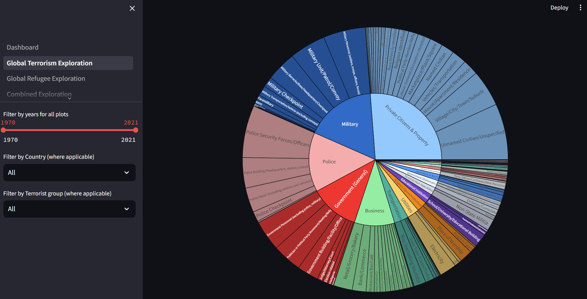
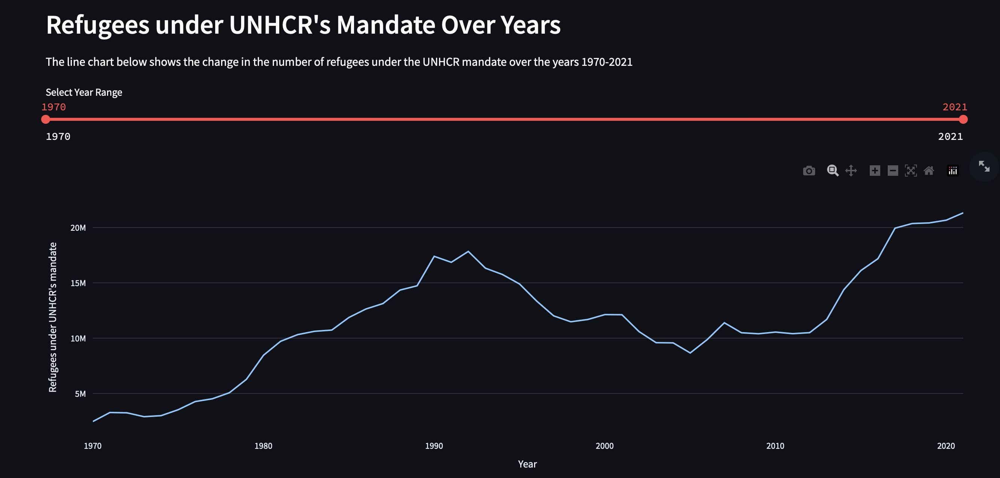
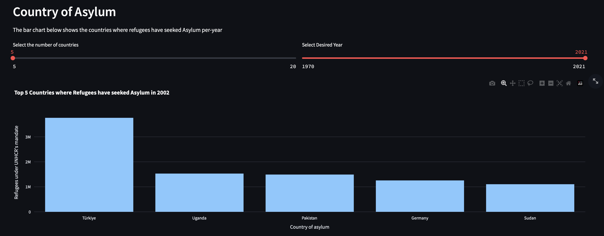

# Final Project Report

**Project URL**: https://github.com/CMU-IDS-Fall-2023/final-project-think_op
**Video URL**: https://www.youtube.com/watch?v=rWnOIYlkeDU

This project seeks to decipher the complex relationship between terrorism and refugee movements, utilizing comprehensive data from the Global Terrorism Database and UN Refugee Data. The former encompasses 214,668 records from 1970 to mid-2021, cataloging terrorist incidents with detailed attributes including location, casualties, and motives. Conversely, the UN Refugee Data chronicles annual refugee figures, specifying their countries of origin and destinations for asylum.

The principal aim is to analyze the progression of terrorist activities over time and across regions and to investigate any potential correlation between the incidence of terrorism and the patterns of refugee migration. We hypothesize a direct link between regional terrorism rates and the resultant movements of refugees. Integrating these datasets allows us to conduct a thorough exploration and time-series analysis, aligning the information based on country and date.

Our deliverable includes a suite of interactive visualizations, designed to engage users and offer profound insights into the dynamics of global terrorism and refugee trends.

The dashboard comprises four interactive pages. Each page enables users to delve into the relationship between the two datasets through various interactive plots. One dedicated page for each dataset provides an overview of recent trends and general patterns in terrorist attacks and refugee flows, acquainting users with the broader context of these complex issues. The other two pages offer a deeper examination of the interconnection between these datasets.

## Introduction

The past few years have been pretty shaky when it comes to world peace. Conflicts have been flaring up in different spots around the globe, causing people to leave their homes in search of a safer place to live. Along with this movement of refugees, there are growing concerns and stereotypes. Some folks worry that refugees might bring conflicts into their new homes. Others wonder if finding safety is the real reason behind their migration. We can't claim to have the definitive answers to all those questions, but what we do have is a data science project that takes a closer look at these complex issues from a statistical point of view.

We have put together an interactive webpage with Streamlit where anyone can play around with the data we've gathered. We designed several pages, each with its own goal and way to dive into the info. It's designed for people to explore and perhaps get a fresh angle on the whole situation with terrorism and refugees.

## Related Work

Böhmelt, Bove, and Nussio 2019; Frey 2020; Legewie 2013; Rabby and Rogers 2010 have time and time again showed that even though there is little evidence to link refugees to terrorist attacks, terrorist attacks may increase the negative views on inmigrants. People incorrrectly assume that the more asylum seekers a country has, the more likely it is to have a terrorist attack. Nonetheless, few studies analyze the opposite relationship. Do terrorist attacks increase the number of asylum seekers? 

Scimeca 2019 showed that people have fled war-torn and politically unstable countries, but these situations do not classify as terrorist attacks. We did not find any work which explicitly addresses how terrorism can affect the number of asylum seekers in a given place in a give time period.

## Methods

We have designed four pages in our interactive webpage. We will discuss the methods used in each of the pages below:

- Global Terrorism:\
    To observe the patterns in the Global Terrorism Database, we have nine visualizations in the dashboard. We provide filters on the left sidebar for range of years with a slider, and for victim country and the culprit terrorist groups with dropdowns. The year filter is applied to all visualizations whereas the country and terrorist group filters are applied to plots where applicable. For the follwoing description, assume that all three filters are applied, unless otherwise stated. the reason we have included the country and terrorist group filters is to observe the connections between the two. The dashboard is divided into four sections: Overall statistics, Targets of attacks, Perpetrators of attacks, and Details of the attacks. 
    
    In the overall statistics section, we have line charts for total number of incidents filtered on country and number of people killed. We also have a map which shows the points of terrorist attacks in red. The size of the points is not proportional to the number of people killed. Under targets of attacks, we have a bar plot which shows the top countries with the most number of terrorist attacks. It can be filtered by the terrorist groups and also enables changing the number of top countries we see. Then a sunburst chart shows the types of targets (e.g. businesses). The perpetrators of attacks can be examined with a bar plot showing the most "active" terrorist groups filtered on country and number of values shown. The motive column in GTD contains text descriptions, so an easy way to get a gist of the motives behind the attacks is with a word cloud. The details of the attacks section has two visualizations, a bar plot which shows the top types of attacks (e.g. bombing) by the terrorists, and a sunburst chart for the types of weapons used. 

- Global Refugee:\
    In order to effectively illustrate the trends and shifts in the global refugee population under the United Nations High Commissioner for Refugees (UNHCR) mandate, we will employ a line chart. This chart will span from 1970 to 2021, providing a comprehensive visual representation of the data. This approach allows for a clear and detailed examination of the changes in refugee numbers over the specified time period. We allow interactivity in tis chart by enabling user to select their desired year range from 1970-2021.

    Next, we observe for a particular year, the countries producing the most number of refugees, by means of a bar chart. We allow the user to select the number of countries they wish to visualize as well as the year for which they want to observe the trend for origin countries of refugees. This is done by means of sliders in Streamlit. We employ the same method and bar chart for visualizing the countries of Asylum for Refugees. Similar to the previous bar chart, we also allow users to select the number of entires and the year they wish to view the results for.

    Finally, to visualize the refugee flows from a particular origin country for a particular year, we implement a Sankey chart. This chart represents the number of refugees from a country of origin that are presenlty in Asylum in the target country. In this chart, the users can select the year, the country, as well as the number of flows to visualize.

- Combined:\
  By integrating the Global Terrorism dataset with the Global Refugee dataset, based on the same countries and years, we're able to perform a comprehensive combined analysis. Initially, we filter for countries present in both datasets, addressing discrepancies such as nations that no longer exist, are not widely recognized, or are specific regions within a country. To standardize country names that might slightly vary (e.g., "US" vs. "United States of America"), we utilized the pycountry library, referring to countries by their ISO codes.

  Next, we create line charts to illustrate the count of terrorist attacks and the flow of refugees entering or leaving the country selected by the user, within their chosen time period. Alongside these visualizations, we calculate and display the correlation coefficient, providing insight into the relationship between terrorist activities and refugee movements.

  Additionally, our analysis extends to identifying the most common destinations or origins for refugees moving from or to the selected country. This aspect of the study helps ascertain if refugees tend to relocate to countries with fewer terrorist incidents, enhancing our understanding of their migration patterns.

- Model:\
    We will model the relationship bewteen refugees and terrorism. Our approach is to create a model that takes as inputs past refugee's data, terrorism attacks and predicts future refugees. What we did was create a model such that $f(refugee_{t-1},terrorism_{t})=refugee_t$, then this model would predict future refugee's trajectory by accounting for past behavour plus current terrorism. We endend up choosing a SARIMAX model, which models the refugees trajectory with an autoregresive model and takes in the terrorism data as exogenous variables. For terrorism data, we particularly select the number of people killed and wounded in a given year. We aggregate all of the terrorism and refugee's data, that means we will be interested in the overall worldwide trend, rather than per country. 

## Results

For each of the pages, we would discuss the results for each of them below:

- Global Terrorism:\
We observe in the following line chart that the number of terrorist incidents has been much higher in the last decade than the years before. 

Around 474,024 people were killed in the world by terrorist attacks between 1970-2021.

The above map shows that the terrorist attacks have occured all over the globe. Even the developed countries show a surprisingly high number of attacks. In this map we can see where the different groups operate. For e.g. Taliban is only active in Afghanistan, whereas groups such as Al-Qaeda and ISIL (ISIS) have conducted terrorist attacks in a variety of places (e.g. France).

The above bar chart shows that Iraq, Afghanistan, Pakistan, India, and Colombia are the countries where the most number of terrorist incidents occured. 

From the sunburst chart, we see that overall, the most number of attacks have occured on Military, Police, Private citizens/properties, government buildings, and businesses. We observe some interesting patterns by using the filters here. For e.g. US has a huge category called "Abortion related" where terrorist attacks have been done on abortion clinics and employees. It is not something that is seen in most other countries. In Israel, we see that highest number of attacks have been done on private citizens and properties.

In the bar plot above, we see that a huge chunk of the terrorist incidents have been carried out by unknown terrorists, which indicates that law enforcement and investigation agencies need to improve their performance. In the solved cases, the top perpetrators are Taliban and ISIL.

- Global Refugee:\
We visualize the trends in the Global Refugee Dataset by means of line chart, bar chart and sankey chart.

From the line chart above, we can observe that the number of refugees started increasing from 1970 to 1992, post which we can observe a relative decline in the number of refugees to 2005. From 2005 to 2021, we observe a continuous increase in the number of refugees with there being more than 21 million refugees under the UNHCR mandate in 2021. We believe that the number of refugees are an acceptable representation of the social, political and economic status of the world.

 

In the bar chart above, we observe the origin countries of refugees in the year 2021. We can observe that Syria has produced the most refugees in 2021 followed by Afghanistan and South Sudan. On rolling back the years to around 2002, we can observe that the country of origin of most refugees is Afghanistan.

 

In the bar chart above, we observe the countires of asylum fro refugees in the year 2021. We can observe that Turkey has sheltered the most refugees in 2021 followed by Uganda and Pakistan. 

 

The sankey chart above visualizes the number of refugees from Afghanistan that have found asylum in target countries in 2021. We can observe that most refugees from Afghanistan have fled to Pakistan or Iran for asylum. If we consider the case fo Syria (not in the above fig), most refugees seek asylum in Turkey followed by Lebanon (in 2021). This seems to suggest that most refugees flee to neighboring countries.

- Combined:\
  Our findings reveal that there's no one-size-fits-all answer when it comes to the relationship between terrorist attacks and refugee movements. The correlation varies significantly from country to country, and the selected time period also greatly influences the correlation coefficient. Contrary to the common belief that refugees might increase the incidence of terrorist attacks in their destination countries, our data does not universally support this claim. Indeed, while some countries show a slight positive correlation between refugee influx and terrorist attacks, many others exhibit little or even negative correlation. This suggests that other factors, such as religious demographics, age and gender composition, and socio-cultural differences between origin and destination countries, might play a crucial role in this complex dynamic.

  Additionally, our analysis indicates that in countries experiencing high levels of terrorism, refugees often seek asylum in nations with fewer terrorist incidents. Conversely, in countries where terrorist attacks are less frequent, this factor becomes less pivotal in influencing refugee destinations, pointing to other motivations behind their choice of asylum.

- Model:\
    Overall, We find that the impact of terrorism in the refugee's trajectory is very small. Given the past refugee's data, the terrorist data does not seem to alter the predictions by much. We find that The number of people killed due to terrorism, is posiively correlated with an increase in refugee's, nonetheless this result is very weak. 

## Discussion

While we don't have all the answers to the myriad questions around refugee movements and terrorism, we've created an interactive space for users to explore and draw their own insights.

In our final observations, we note a varying degree of correlation between terrorist activities and the flow of refugees to and from a country. This complexity is understandable considering the multitude of factors that influence someone to leave their home, such as natural calamities, political unrest, and yes, terrorism too—which is just one of the potential drivers we're examining.

Our analysis of the primary destinations and origins of refugees from specific countries has revealed diverse trends. Some patterns indicate that refugees tend to move away from regions with higher levels of terrorist violence, while others suggest alternative motivations, like the pursuit of better living conditions or the simplicity of geographic proximity.

## Future Work

Looking ahead, our aim is to broaden our understanding of refugee movements by integrating additional datasets that provide deeper insights into the forces driving people to seek asylum. Enhanced monitoring and potentially predicting refugee flows could significantly aid in maintaining social stability and optimizing the distribution of humanitarian aid. As for terrorism, bringing in supplementary data, like the Human Development Index, might yield a more nuanced view of how terrorism affects various facets of societal progress.

Moreover, expanding our analytical toolkit could enrich user interaction. Currently, our approach utilizes a basic ARIMA model for time-series forecasting. However, other advanced models like Prophet or LSTM offer promising alternatives for such analysis. We plan to introduce a variety of these models down the line, allowing users to compare their performance directly on our datasets.

## References
Böhmelt, Tobias, Vincenzo  Bove, and Enzo  Nussio. 2019. “Can Terrorism Abroad Influence Migration Attitudes at Home?” American Journal of Political Science  64(3):437–51.

Frey, Arun. 2020. “‘Cologne Changed Everything’—The Effect of Threatening Events on the Frequency and Distribution of Intergroup Conflict in Germany.” European Sociological Review  36(5):684–99.
Google ScholarFind in my libraryWorldCat

Legewie, Joscha. 2013. “Terrorist Events and Attitudes toward Immigrants: A Natural Experiment.” American Journal of Sociology  118(5):1199–245.

Rabby, Faisal, and William M.  III Rogers. 2010. “The Impact of 9/11 and the London Bombings on the Employment and Earnings of U.K. Muslims.” IZA Discussion Papers  4763:1–31.

Scimeca, Taylor M. "The European Immigration Crisis: An Analysis of How Terror Attacks Have Affected Immigrant and Refugee Populations in Western Europe." Honors in the Major Program in Political Science, University of Central Florida, 2017.
